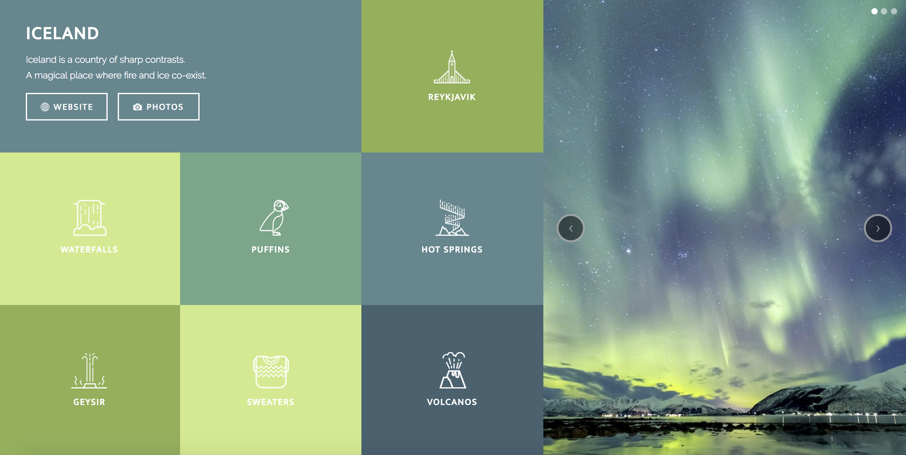

# tm-comp-challenge-1
Static Comp Challenge #1

This first static comp I decided to go with an Icelandic theme. I used flexbox to center most of the elements besides the overall formatting which I used floats and vh/vw heights & widths. To add a little flare to the webpage I animated some of the icons when hovering over their parent container.

I tried to create a aesthetically pleasing mobile version of the webpage that allowed for all the buttons and title block to be image as well as the main image through a very different format than the desktop version.

